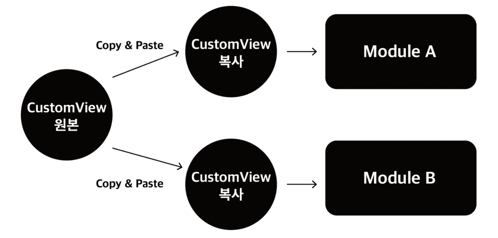
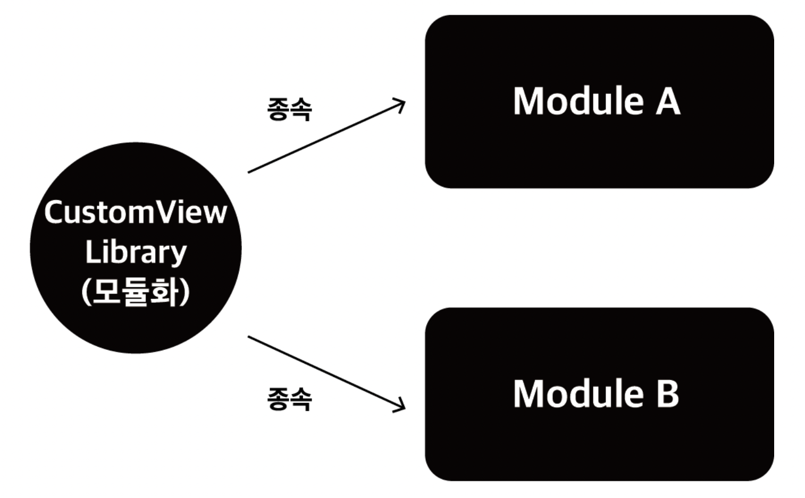

# Multi Module

###  - 모듈이란?
> 모듈은 소스 파일 및 빌드 설정으로 구성된 모음이며, 이를 통해 프로젝트를 별개의 기능 단위로 분할할 수 있습니다. 프로젝트에는 하나 이상의 모듈이 포함될 수 있으며, 하나의 모듈이 다른 모듈을 종속 항목으로 사용할 수 있습니다. 각 모듈을 독립적으로 빌드, 테스트, 디버그할 수 있습니다.  

### - 모듈의 종류
1. Android 앱 모듈
> 앱 소스 코드, 리소스 파일 및 앱 수준 설정(예: 모듈 수준의 빌드 파일 및 Android 매니페스트 파일)을 포함하기 위한 컨테이너를 제공합니다. 새 프로젝트를 만들 때 기본 모듈 이름은 'app'입니다.  
>Create New Module 창에서 Android 스튜디오가 제공하는 앱 모듈의 유형은 다음과 같습니다.  
>1. 스마트폰 및 태블릿 모듈  
>2. Wear OS 모듈  
>3. Android TV 모듈  
>4. Glass 모듈  

2. 기능 모듈
> Play Feature Delivery를 활용할 수 있는 모듈화된 앱 기능을 나타냅니다.

3. 라이브러리 모듈
> 다른 앱 모듈에서 종속 항목으로 사용하거나 다른 프로젝트로 가져올 수 있는 재사용 가능 코드를 포함하기 위한 컨테이너를 제공합니다. 라이브러리 모듈은 구조적으로 앱 모듈과 같습니다. 단, 빌드될 때 APK가 아니라 코드 보관 파일이 생성되므로 기기에 설치할 수 없습니다.  

> Android 스튜디오는 Create New Module 창에서 다음과 같은 라이브러리 모듈을 제공합니다.  
>* Android 라이브러리: 이 유형의 라이브러리는 소스 코드, 리소스 및 매니페스트 파일을 비롯하여 Android 프로젝트에서 지원되는 모든 파일 형식을 포함할 수 있습니다. 빌드 결과로 Android 보관 파일(AAR)이 생성되며, 이 파일은 Android 앱 모듈에 종속 항목으로 추가할 수 있습니다.  
>* 자바 라이브러리: 이 유형의 라이브러리는 자바 소스 파일만 포함할 수 있습니다. 빌드 결과로 자바 아카이브(JAR) 파일이 생성되며, 이 파일은 Android 앱 모듈 또는 기타 자바 프로젝트에 종속 항목으로 추가할 수 있습니다.

4. Google Cloud 모듈
> Google Cloud 백엔드 코드를 포함하기 위한 컨테이너를 제공합니다. 이 모듈은 단순한 HTTP, Cloud Endpoints 및 클라우드 메시징을 사용하여 앱에 연결하는 자바 App Engine 백엔드를 위한 종속 항목 및 필수 코드를 포함합니다. 백엔드를 개발하여 앱에 필요한 클라우드 서비스를 제공할 수 있습니다.

### - 멀티 모듈?
* 안드로이드 스튜디오를 통해 처음 프로젝트를 생성하게 되면 app 이라는 모듈이 하나 생성되는것을 볼 수 있다. 일반적으로는 하나의 app 모듈 안에서 패키지 단위로 나누어 개발을 진행한다.  
멀티 모듈이란 하나의 app 모듈을 여러개의 모듈로 쪼개는것을 말한다.

 * 장점  
    1. 코드의 재사용성 증가
    2. 빌드시간 단축

1. 코드의 재사용성 증가

- 위와같은 경우에는 일반적인 동작에는 전혀 문제가 없다. 하지만 A 모듈에서 사용하고있는 CustomView 에서 오류가 발생했다면 A 모듈의 CustomView 를 수정하면 해결되겠지만 같은 CustomView 를 복사해서 사용하던 B 모듈에서도 동일한 오류가 발생하고있을 것이다. 이런식으로 100개의 모듈에서 CustomView 를 사용하고 있었다면 100개의 CustomView 를 일일이 찾아서 변경해야 한다는것이다.

- CustomView 를 모듈화 하여 위와같이 A, B 모듈에 각각 종속시키게되면 일일이 찾아서 변경할 필요가 없어진다.

1. 빌드시간 단축

([출처](https://www.freecodecamp.org/news/how-modularisation-affects-build-time-of-an-android-application-43a984ce9968))

- 15,000개의 클래스를 하나의 Application 모듈에서 빌드했을때와 하나의 Application 모듈과 2개, 4개의 Library 모듈로 나누어 빌드했을때의 시간을 측정한 결과이다. Application 모듈만 변경 후 빌드했을 때 분리가 많이 되어있을수록 짧은 빌드시간을 확인할 수 있다. 하지만 Library 모듈을 변경했을 때 오히려 1분10초 보다 긴 1분 32초가 걸린다. 왜그럴까?

[참고 링크1](https://developer.android.com/studio/projects?hl=ko)  
[참고 링크2](https://www.youtube.com/watch?v=H4qh0n9Zu5k)
